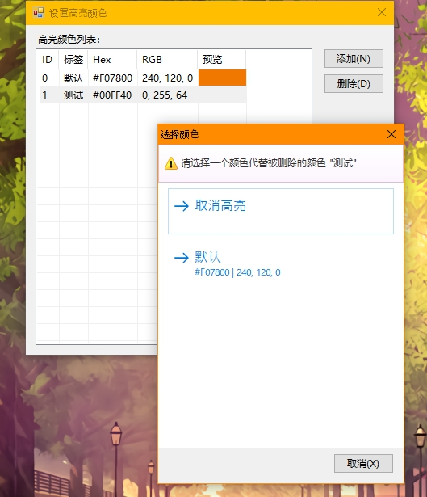
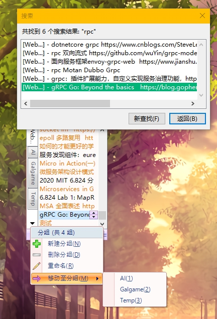
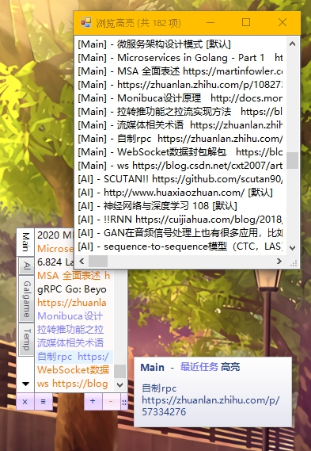

# DesktopTips

+ A persistent desktop memo tool written in `VB.net Winforms`
+ For Android version, visit [DesktopTips_Android](https://github.com/Aoi-hosizora/DesktopTips_Android) (**under no maintenance**)

### Environment

+ `VB.NET` 14.0
+ `.NET Framework` 4.0
+ (`Visual Studio` 2010 + `Rider` 2020.3.2)

### Dependencies

+ `Dotnetbar` 10.8.0.0
+ `Newtonsoft.Json` 12.0.2

### Functions (v3.0)

+ [x] Tip with color, done check, time record
+ [x] Tip CRUD
+ [x] Color CRUD
+ [x] Tab CRUD
+ [x] Image upload
+ [ ] ...

### Tips

+ Data file: `.config\DesktopTips\model.json`
+ Setting: `AppData\Local\DesktopTips`

### Screenshots

|||||
|---|---|---|---|

