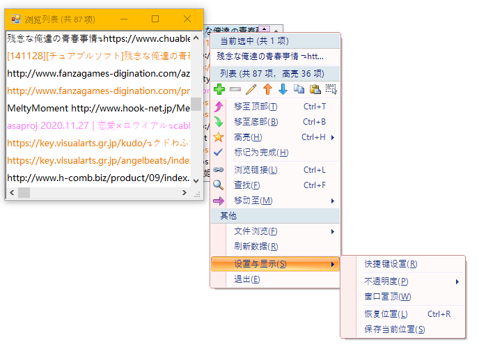

# DesktopTips

+ A persistent desktop memo tool written in `VB.net Winforms`
+ For Android version, visit [DesktopTips_Android](https://github.com/Aoi-hosizora/DesktopTips_Android) (**under no maintenance**)

### Environment

+ `VB.NET` 14.0
+ `.NET Framework` v4.8
+ (`Visual Studio` 2010 + `Rider` 2020.3.2)

### Dependencies

+ `Dotnetbar` 10.8.0.0
+ `Newtonsoft.Json` 12.0.2

### Functions (v3.1)

+ [x] Tip CRUD
+ [x] Color CRUD
+ [x] Tab CRUD
+ [x] Tip with highlight color, tab grouped, done check, time record
+ [ ] ...

### Tips

+ Data file: `.config\DesktopTips\data.json`
+ Setting: `AppData\Local\DesktopTips`
+ File format:

```json
{
  "colors": [
    {
      "id": 0,
      "name": "红色",
      "color": "#FF0000",
      "created_at": "2021-02-17T02:36:46.3517519+08:00",
      "updated_at": "2021-02-17T02:36:46.3517519+08:00"
    }
  ],
  "tabs": [
    {
      "title": "默认",
      "created_at": "2021-02-17T02:36:46.3517519+08:00",
      "updated_at": "2021-02-17T02:36:46.3517519+08:00",
      "tips": [
        {
          "id": 0,
          "content": "普通标签",
          "color": -1,
          "done": false,
          "created_at": "2021-02-17T02:36:46.3517519+08:00",
          "updated_at": "2021-02-17T02:36:46.3517519+08:00"
        }
      ]
    }
  ]
}
```

### Screenshots

||||
|---|---|---|
||||
