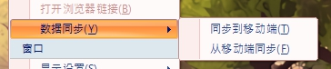
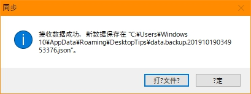

# DesktopTips
+ `VB.net` 编写的桌面备忘录工具
+ 安卓端 [DesktopTips_Android](https://github.com/Aoi-hosizora/DesktopTips_Android) (主要是用来更新同步信息，可能有一些 Bug)

### 环境
+ `MSVB` 2010
+ `.NET Framework` 4.0

### 依赖
+ `Dotnetbar` 10.8.0.0
+ `Newtonsoft.Json` 12.0.2

### 功能 (v2.1)
+ [x] 备忘录，高亮显示
+ [x] 分组，分组移动
+ [ ] ...

### 待改
+ [ ] ...

### 说明
+ 注册表设置
    + `\HKEY_USERS\S-x-x-x-x\Software\VB and VBA Program Settings\DesktopTips\`
    + `FormSize` , `PosSize`

```vb
' Util\SettingUtil.vb
SaveSetting(AppName, PosSection, "Top", Me.Top)
SaveSetting(AppName, FormSection, "Opacity", MaxOpacity)
```

+ 文件访问
	+ 文件系统：`AppData\Roaming`
	+ 使用 `json` 格式存储，结构见 [Tab.vb](https://github.com/Aoi-hosizora/DesktopTips/blob/master/Src/Model/Tab.vb) 和 [TipItem.vb](https://github.com/Aoi-hosizora/DesktopTips/blob/master/Src/Model/TipItem.vb)

```vb
Public Shared StorageFileDir As String = Environment.GetFolderPath(Environment.SpecialFolder.ApplicationData) & "\DesktopTips"
Public Shared StorageJsonFile As String = StorageFileDir & "\data.json"

' C:\Users\xxx\AppData\Roaming\DesktopTips\data.json
```

### 截图


