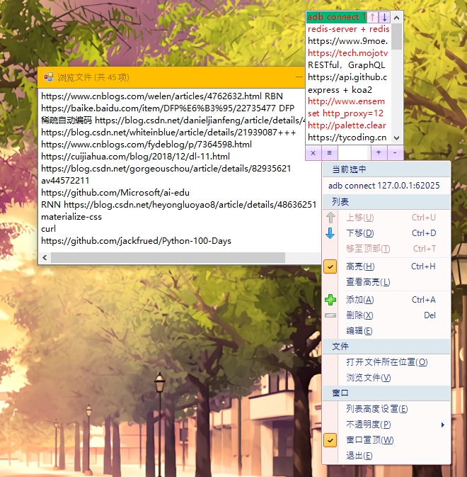

# DesktopTips
+ `VB.net` 编写的桌面备忘录工具
+ (学了两年 SE 了还在用以前学的 `VB.net` 写工具)

### 环境
+ `MSVB` 2010
+ `.NET Framework` 4.0
+ `Dotnetbar` 10.8 (习惯)

### 说明
+ 注册表设置
    + `\HKEY_USERS\S-x-x-x-x\Software\VB and VBA Program Settings\DesktopTips\`
    + `FormSize` , `PosSize`

```vb
SaveSetting(AppName, PosSection, "Top", Me.Top)
SaveSetting(AppName, FormSection, "Opacity", MaxOpacity)
```

+ 文件访问
	+ 文件系统：`AppData\Roaming`

```vb
Private FileDir As String = Environment.GetFolderPath(Environment.SpecialFolder.ApplicationData) & "\DesktopTips"
Private FileName As String = FileDir & "\SavedItem.dat"
' C:\Users\xxx\AppData\Roaming\DesktopTips\SavedItem.dat
```

+ 文件格式记录
	+ 列表内容 + 高亮判断：`RESTful，GraphQL，APIJSON,,,0`

```vb
Private MagicSign As String = ",,,"
Private HighLightedSign As String = MagicSign & "1"
Private UnHighLightSign As String = MagicSign & "0"

If HighItems.Contains(item) Then
    Buf.Append(vbNewLine & item.ToString() & HighLightedSign)
Else
    Buf.Append(vbNewLine & item.ToString() & UnHighLightSign)
End If
```

### 截图
