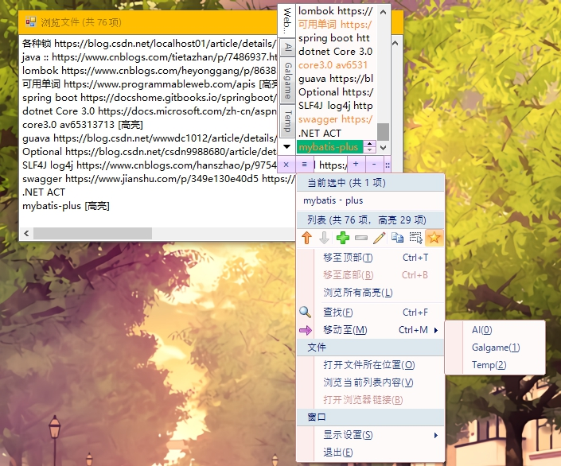

# DesktopTips

+ A persistent desktop memo tool written in `VB.net Winforms`
+ Android version: please see [DesktopTips_Android](https://github.com/Aoi-hosizora/DesktopTips_Android) (Mainly for update from desktop, may have some bugs)

### Environment

+ `VB.NET` 14.0
+ `.NET Framework` 4.0
+ (`VS` 2010 + `Rider` 2019.2.3)

### Dependencies

+ `Dotnetbar` 10.8.0.0
+ `Newtonsoft.Json` 12.0.2

### Functions (v2.1)

+ [x] Base memo
+ [x] Highlight
+ [x] Grouping
+ [ ] ...

### Tips

+ Windows setting in register
    + `\HKEY_USERS\S-x-x-x-x\Software\VB and VBA Program Settings\DesktopTips\`
    + See [SettingUtil.vb](src/util/SettingUtil.vb)
+ Memo content
    + `AppData\Roaming\DesktopTips\data.json`
    + See [GlobalModel.vb](src/model/GlobalModel.vb)

### Screenshot

