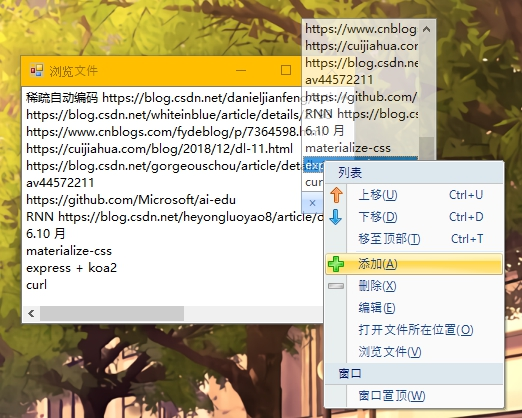

# DesktopTips
+ `VB.net` 编写的桌面备忘录工具
+ (学了两年 SE 了还在用几年前学的 `VB.net` 写小工具)

### 环境
+ `MSVB` 2010
+ `.net Framework` 4.0
+ `Dotnetbar` 10.8 (习惯)

### 说明
+ 文件访问
	+ 注册表：`SaveSetting(AppName, Section, "Top", Me.Top)`
	+ 文件系统：`AppData\Roaming`

```vb
Private FileDir As String = Environment.GetFolderPath(Environment.SpecialFolder.ApplicationData) & "\DesktopTips"
Private FileName As String = FileDir & "\SavedItem.dat"
' C:\Users\xxx\AppData\Roaming\DesktopTips\SavedItem.dat
```

### 截图
